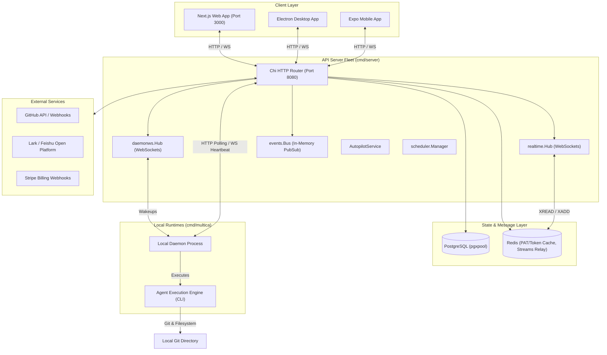
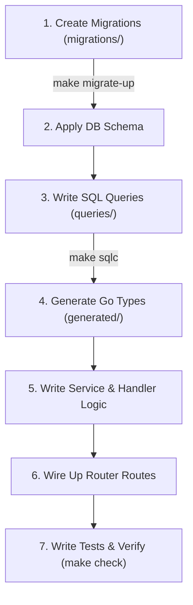

# Multica Backend Architecture & System Design (`server/`)

This document provides a comprehensive technical guide to the architecture, design decisions, code styles, and core patterns of the Multica backend.

---

## Table of Contents
1. [System Overview & Monorepo Role](#1-system-overview--monorepo-role)
2. [Directory Structure Map](#2-directory-structure-map)
3. [Developer Workflow (First Steps for Feature Development)](#3-developer-workflow-first-steps-for-feature-development)
4. [Key Engineering & Design Decisions](#4-key-engineering--design-decisions)
5. [High-Level Architecture & Core Concepts](#5-high-level-architecture--core-concepts)
6. [Database Layer & SQL Compilation](#6-database-layer--sql-compilation)
7. [API, Routing, & Middleware](#7-api-routing--middleware)
8. [Real-Time Subsystem & Horizontal Scaling](#8-real-time-subsystem--horizontal-scaling)
9. [Background Workers & Services](#9-background-workers--services)
10. [Local Daemon Process (`daemon/`)](#10-local-daemon-process-daemon)
11. [Integrations Architecture](#11-integrations-architecture)
12. [Observability & Metrics](#12-observability--metrics)
13. [Core Commands Reference](#13-core-commands-reference)

---

## 1. System Overview & Monorepo Role

Multica is an AI-native task management platform. The backend is written in **Go (Golang)** and is situated in the `server/` directory of the monorepo. It serves two distinct roles:

1. **The API Server (`server/cmd/server`)**: A high-performance, multi-tenant HTTP and WebSocket server that handles business logic, database mutations, real-time client communication, and third-party integrations (GitHub, Lark, Stripe).
2. **The CLI & Daemon (`server/cmd/multica`)**: A local runtime binary compiled from the same codebase. It runs on users' local environments (or containerized fleets) to synchronize Git repositories, execute agent tasks (using custom AI models and tool libraries), and stream progress back to the API Server.



---

## 2. Directory Structure Map

The backend codebase is organized into three main boundaries: `cmd/` for entrypoints, `internal/` for private domain logic, and `pkg/` for shared libraries.

### `server/cmd/` — Entrypoints & Execution Binaries
- **`server/`**: The core API server. Boots the Chi HTTP router, initializes database connection pools (`pgxpool`), sets up metrics/health endpoints, establishes event listeners, and runs WebSocket hubs.
- **`multica/`**: The local CLI and runtime Daemon. Acts as the daemon execution client when started as a background process and supports terminal CLI commands (e.g., `multica config`, `multica login`).
- **`migrate/`**: Direct database migration runner. Integrates migration scripts into deployment pipelines.
- **`backfill_task_usage_hourly/`**: Maintenance command used by operators to recalculate or backfill hourly usage metrics from raw task execution logs.

### `server/internal/` — Business Logic & Internal Services
- **`agenttmpl/`**: Resolves agent templates (browsing templates, resolving referenced skills, and importing them into workspaces).
- **`analytics/`**: Event tracking client wrapper (PostHog/Segment integration) with a no-op fallback for development.
- **`auth/`**: Auth token parsing, JWT session verification, Personal Access Token (`PATCache`) validation, CloudFront URL signature generation for attachments, and Cloud PAT validation (`mcn_` tokens checked against Multica Cloud Fleet).
- **`cli/`**: Shared configuration helpers and update executors backing the local `multica` CLI commands.
- **`cloudruntime/`**: Proxy client routing API calls to containerized SaaS fleets (creating/rebooting nodes, running code, and tracking terminal outputs).
- **`daemon/`**: Local agent daemon implementation. Coordinates Git cache repository mapping (`repoCache`), heartbeats, task claiming, and background updates.
- **`daemonws/`**: WebSocket connection manager (`daemonws.Hub`) for runtimes, serving heartbeats and task wakeups.
- **`events/`**: Central synchronous pub/sub event bus (`events.Bus`) with safety closures to isolate panics inside listeners.
- **`handler/`**: REST and Webhook request endpoints. Coordinates transactions, maps parameters, and formats JSON responses.
- **`integrations/lark/`**: Lark/Feishu integration. Features Region-Aware URL routing (mainland Feishu vs. international Lark), long-connection WebSocket connectors, outcome replies, and QR OAuth setup.
- **`issueguard/`**: Advisory lock wrappers (`LockIssueDuplicateKey`) that prevent duplicate issue rows from being created concurrently.
- **`issueposition/`**: Positioning helpers calculating layout coordinate offsets for manually sorted issue cards.
- **`logger/`**: Structured logger built on top of the standard library `log/slog`.
- **`mention/`**: Expands bare issue keys (e.g. `MUL-117`) in descriptions and comments into rich `mention://issue/<uuid>` links.
- **`metrics/`**: Observability registries collecting latency histograms, connection states, and business counters for Prometheus.
- **`middleware/`**: Standard HTTP filter middlewares (Recovery, RequestID, Auth, CORS, Content Security Policy, and header tracing).
- **`migrations/`**: Code hooks executing script files in order during migrations.
- **`realtime/`**: WebSocket client hub managing multi-tenant scope subscription rooms and sharded Redis relays.
- **`scheduler/`**: Distributed cron scheduler managing lease loops (`sys_cron_executions`) and pg_advisory transaction locks.
- **`service/`**: Core domain logic services:
  - `task.go`: Claims, retries, and queues engine tasks.
  - `issue.go`: Handles transactional operations on issue assignments.
  - `autopilot.go`: Coordinates cron/webhook triggers, templates, and skips runs when runtimes are offline.
  - `email.go`: Sends verification codes via SMTP/Resend or prints to logs in development.
- **`skill/`**: Manages engine skills (code tool definitions) and attachments.
- **`storage/`**: Unified driver abstraction interfacing Local storage or S3 buckets.
- **`taskusagebackfill/`**: Calculations and data queries for hourly backfilling.
- **`util/`**: Helpers for UUID formatting, string parsing, and date conversions.

### `server/pkg/` — Shared Boundaries & Libraries
- **`agent/`**: Evaluates system paths and verifies agent version requirements.
- **`db/`**: Holds raw migration files (`migrations/`), sqlc templates (`queries/`), and auto-generated SQL client files (`generated/`).
- **`protocol/`**: Unified frame schemas and JSON payloads exchanged between the server, WebSockets, and CLI/Daemon.
- **`redact/`**: Sanitizer utility removing secrets/tokens from output streams.
- **`taskfailure/`**: Formats and parses task-level execution failures.

---

## 3. Developer Workflow (First Steps for Feature Development)

When developing a new backend feature or modifying existing business processes, developers follow a strict, database-first compilation workflow. Because the database acts as the single source of truth for both structural constraints and query execution paths, you must construct the relational foundation before writing Go services.



### Step 1: Define the Database Schema (Migrations)
All tables, columns, indexes, and FK constraints are versioned sequentially under `server/migrations/`.
1. Create a pair of SQL files named after the next sequential number (e.g. `120_my_new_feature.up.sql` and `120_my_new_feature.down.sql`).
2. Write clean DDL commands (e.g. `CREATE TABLE`, `ALTER TABLE`) in the `.up.sql` file and their corresponding rollbacks in the `.down.sql` file.
3. Apply the changes locally by running:
   ```bash
   make migrate-up
   ```

### Step 2: Define the SQL Queries (`queries/`)
Rather than relying on runtime reflection or SQL statement strings in Go, write raw SQL queries under `server/pkg/db/queries/`.
1. Locate the file corresponding to the domain entity you are modifying (e.g., `issue.sql`, `agent.sql`) or create a new one.
2. Write your SQL query annotated with `sqlc` attributes defining the function name and expected return type:
   ```sql
   -- name: GetAgentByProfile :one
   SELECT * FROM agent WHERE profile_name = $1 LIMIT 1;
   ```

### Step 3: Compile Database Helpers via `sqlc`
Generate type-safe Go structs and functions corresponding to your DDL schemas and queries:
1. Run the compilation target from the repository root:
   ```bash
   make sqlc
   ```
2. The compilation output is saved automatically inside `server/pkg/db/generated/`. Do not edit the generated files directly.

### Step 4: Implement Domain Service Logic
Write the business logic inside the appropriate service file in `server/internal/service/`. Services are responsible for:
- Enforcing structural constraints (e.g. verifying an agent has a runtime bound).
- Publishing events to the event bus (`s.Bus.Publish`).
- Driving background scheduling tasks.

### Step 5: Implement HTTP Handler Methods
Handlers act as transport wrappers, translating HTTP requests to service commands. Implement handler endpoints in `server/internal/handler/`:
1. Parse URL arguments and validate UUID shapes using the strict `parseUUIDOrBadRequest` helper.
2. Decode the request body using Go JSON decoders.
3. Execute database actions or call your domain services.
4. Output JSON envelopes using the standard `writeJSON` helper.

### Step 6: Route Wiring & Integration
Expose the new handler endpoints via routing rules in `server/cmd/server/router.go`:
- Group your route under the appropriate access control tier (`Public`, `Auth` protected, `RequireWorkspaceMember`, or `Owner` only).

### Step 7: Write Tests & Run Verification Pipelines
Tests are written adjacent to code files (e.g. `issue_test.go` or `handler_test.go`). Run local verification routines:
- Run Go standard tests: `make test`
- Run the full project pipeline: `make check`

---

## 4. Key Engineering & Design Decisions

### 1. Cache Versioning to Prevent the Empty-Claim Race
To reduce Postgres pressure, the backend utilizes `EmptyClaimCache` (`server/internal/service/empty_claim_cache.go`).
- **The Problem**: Local daemons frequently poll the server seeking new tasks. Direct Postgres queries on `agent_task_queue` under high poll rates waste database cycles. If the server caches a "no queued task" verdict, a concurrency race condition appears:
  - T1 (claims a task): queries Postgres, gets empty. (Suffers thread pause).
  - T2 (enqueues a task): writes new task row, sends WS wakeup.
  - T1 (resumes): writes the "empty" cache key to Redis.
  - T3 (claims a task): hits the stale "empty" cache key, and the new task sits idle until the cache TTL expires.
- **The Solution**: An invalidation version counter is stored per runtime. The server reads the version before querying Postgres. When enqueuing, the version is incremented (`INCR`). The "empty" cache key is stored tagged with the version it was observed under. When checking, the cached version is compared to the current version; if they mismatch, the cache is bypassed, forcing a Postgres check. This ensures tasks never stall while keeping idle poll rates off Postgres.

### 2. Batched Heartbeat Bumping
When hundreds of agent runtimes are online, they report heartbeats at short intervals (15s).
- **The Problem**: Issuing a direct `UPDATE` statement per heartbeat creates high database write transaction pressure on the `agent_runtime` table.
- **The Solution**: The `BatchedHeartbeatScheduler` (`server/internal/handler/heartbeat_scheduler.go`) queues bump requests in a thread-safe map. A background goroutine flushes these IDs using a single bulk UPDATE statement every 30s (`TouchAgentRuntimesLastSeenBatch`). 
- **Graceful Degradation & Draining**: Transition heartbeats (e.g. offline-to-online state changes) bypass the queue to execute immediately. During server shutdown, a lifecycle drain routine executes one final flush before exiting, preventing online runtimes from appearing offline during rolling deploys.

### 3. Task-Scoped Token Validation & Human Actor Guards
Agents run user-provided scripts locally. To isolate credentials and prevent lateral movement:
- **Task Tokens (`mat_`)**: When enqueuing a task, the server mints a temporary task-scoped token. The daemon and local agent process authenticate using this token.
- **Actor Identity Binding**: The authentication middleware translates this token into an authoritative context containing the specific `AgentID` and `TaskID`. The server injects the header `X-Actor-Source = task_token`.
- **Lateral Movement Blocks**: The `RequireHumanActor` middleware inspects the `X-Actor-Source` header. If a task-scoped actor attempts to access account settings, checkout sessions, billing portals, or send workspace invitations, the router blocks the request with a `403 Forbidden`.

### 4. Bounded Lark/Feishu WebSocket Lease System
Lark integrations use WebSocket long connections (`WSLongConnConnector`) rather than exposed HTTP webhook callbacks.
- **Duplicate Processing Prevention**: Because Lark streams events over open sockets, we must guarantee that only one API replica maintains a connection per installation.
- **Distributed Lease**: Runtimes lease connection permissions via DB keys with a strict TTL. Replicas renew the lease periodically.
- **Graceful Release Watchdog**: During server shutdown, a watchdog context cancels blocking socket read loops, letting the supervisor loop explicitly yield the lease before the process dies. This lets rolling API replicas pick up the connection immediately without waiting for the natural LeaseTTL to expire.

### 5. Horizontal WebSocket Scaling via Sharded Redis Streams
When clients connect to different API nodes, events broadcast on one replica must reach WebSocket hubs on all other replicas.
- **Relay Scaling Problem**: Using standard Redis Pub/Sub creates a thread subscription model that grows linearly with active user scopes.
- **The Solution**: The `ShardedStreamRelay` hashes workspace/user/task scopes into a fixed number of Redis Streams (default: 8 shards). Each API node runs exactly one blocking consumer loop (`XREAD`) per shard. This bounds the total blocked Redis connections at `node_count * shard_count` instead of active room subscriptions.

---

## 5. High-Level Architecture & Core Concepts

### Monorepo Boundaries & Platform Bridges
The frontend applications (Next.js, Electron) share business logic via internal TS packages (`packages/core/`, `packages/views/`). 
- **Server State (TanStack Query)**: TanStack Query owns all server state. When the backend triggers an action, it publishes a WebSocket event. The client listens to this event and invalidates the corresponding React Query cache key. No server state is directly duplicated or written into Zustand.
- **Client State (Zustand)**: Local preferences, drafts, and active UI states are kept strictly in Zustand stores within `packages/core/` (completely isolated from the server).

### In-Process Event Bus (`events.Bus`)
All domain events (e.g. `issue:created`, `comment:created`, `task:completed`) are published to an in-process, synchronous event bus (`server/internal/events/bus.go`). 
- **Panic Isolation**: Listeners run under recovered closures to prevent a single failing hook (e.g. a broken webhook dispatcher) from crashing the main request thread or aborting database transactions.
- **Sync Event Handlers**: Key listeners register synchronously during boot to record activities, create notifications, or trigger autopilots.

---

## 6. Database Layer & SQL Compilation

Multica uses **PostgreSQL** (version 17 + `pgvector`) as its primary database, managed via **sqlc** and **pgx/v5**.

### 1. Connection Pool (`pgxpool`)
Database connections are managed via a thread-safe `*pgxpool.Pool` configured with custom healthchecks and connection limits.
- **Separate Pool for Scraping**: To prevent Prometheus scraper queries from blocking user HTTP requests, a separate pool (`samplerPool`) is created for business metrics compilation.

### 2. SQL Compilation (`sqlc`)
SQL queries are written in raw SQL files (`server/pkg/db/queries/`) and compiled into type-safe Go code using `sqlc` (`server/pkg/db/generated/`).
- **No ORM Overhead**: All DB reads and writes use direct, type-safe queries.
- **Transaction Safety**: Transactions (`pgx.Tx`) are used extensively, passing the transaction context down through `Queries.WithTx(tx)` to enforce atomicity.

### 3. Migrations (119+ Migrations)
Database schemas are versioned through incremental migration files (`server/migrations/`).
- Migrations are driven by the `migrate` CLI wrapper during deployment and local bootstrap (`make migrate-up`).
- High-performance indexes (like trgm/lower indexing for searches, and keyset pagination indexes for timelines) are explicitly defined.

---

## 7. API, Routing, & Middleware

The HTTP router is built on **go-chi/chi/v5** (`server/cmd/server/router.go`), organizing endpoints into clear security groups.

### Core Security & Middleware Pipeline
1. **Global Chain**: `RequestID` → `ClientMetadata` (device info) → `RequestLogger` → `HTTPMetrics` → `Recoverer` (panics translate to 500s) → `CORS`.
2. **User Authenticated (`middleware.Auth`)**: Validates JWTs (for web) and Personal Access Tokens (`mul_` hashes) via a Redis-backed token cache (`auth.PATCache`).
3. **Workspace Bound (`middleware.RequireWorkspaceMember`)**: Ensures the authenticated user belongs to the workspace passed via `X-Workspace-ID` or `X-Workspace-Slug`.

### Key Design Invariants

#### 1. UUID Parsing Convention
To prevent silent vulnerabilities and database corruptions, the backend enforces a strict boundary between user input and database execution:
- **Unvalidated Request Boundaries**: URL parameters, request bodies, and headers must be validated via `parseUUIDOrBadRequest(w, s, fieldName)`. If parsing fails, the handler writes a `400 Bad Request` and returns immediately. This avoids bugs where invalid input silently translates to a zero UUID, matching wrong rows during `DELETE` or `UPDATE` queries.
- **Trusted Paths**: Round-trips of DB-sourced UUIDs use `parseUUID(s)`, which panics on invalid input. This panic is recovered by Chi's recovery middleware and translated into a `500 Internal Server Error`.

#### 2. Human Actor Guard (`RequireHumanActor`)
Agent actors operate in the system using task-scoped tokens (`mat_`). To prevent an compromised agent process from performing lateral movements (e.g. inspecting user billing balances, initiating checkouts, or inviting other actors), the router blocks non-human actors on account-level endpoints using the `RequireHumanActor` middleware.

---

## 8. Real-Time Subsystem & Horizontal Scaling

Multica handles real-time updates through WebSocket connections managed by two hubs under `server/internal/realtime/` and `server/internal/daemonws/`.

### Client WebSockets (`realtime.Hub`)
Browser and desktop clients maintain WebSocket connections to subscribe to specific rooms.
- **Scope-Based Rooms**: Connection rooms are categorized into `workspace`, `user`, `task`, and `chat` scopes. 
- **Scope Authorization**: Users are auto-subscribed to workspace and user scopes. Subscriptions to individual tasks or chat sessions are gated by a database-backed `ScopeAuthorizer`.
- **Slow Client Eviction**: Clients with saturated send channels are evicted under a write lock. This prevents a slow network node from blocking the hub's broadcast loop.

### Real-time Relay (Horizontal Scaling)
When scaled across multiple nodes, the API server must distribute WebSocket messages globally. This is achieved via a multi-tier relay configuration (`REDIS_URL`):

```
Local Event Bus ────> DualWriteBroadcaster
                           │
             ┌─────────────┴─────────────┐
             ▼                           ▼
        Local Hub                 ShardedStreamRelay
     (Local Clients)            (XADD ws:relay:shard:N)
                                         │
                                         ▼
                                   Redis Streams
                                         │
                       ┌─────────────────┴─────────────────┐
                       ▼                                   ▼
                Node A Relayer                      Node B Relayer
           (XREAD ws:relay:shard:N)            (XREAD ws:relay:shard:N)
                       │                                   │
                       ▼                                   ▼
                 Local Hub A                         Local Hub B
```

1. **DualWriteBroadcaster**: Broadcasts locally for instant delivery (fast path) and publishes globally to Redis.
2. **Sharded Redis Stream Relay (`ShardedStreamRelay`)**: Distributes traffic across a fixed set of Redis Stream shards (default: 8).
3. **Fixed Blocking Readers**: Each node spawns exactly one blocking `XREAD` reader per shard. This caps the number of blocked Redis connections at `node_count * shard_count` rather than `active_client_count`.
4. **ULID Deduplication**: Local clients maintain a sliding window of recently delivered ULIDs to deduplicate fast-path messages from relay-replayed messages.

### Daemon WebSockets (`daemonws.Hub`)
Local daemons connect via a dedicated endpoint (`/api/daemon/ws`) to receive task execution wakeups. Runtimes authenticate using daemon tokens (`mdt_`), mapping to their configured workspaces.

---

## 9. Background Workers & Services

### 1. Autopilot Execution (`AutopilotService`)
Autopilots automate agent workflows based on cron schedules or webhooks.
- **Trigger-Time Admission Check ("触发时准入")**: Before queueing scheduled tasks, the admission check verifies the assignee agent's runtime status. If the runtime is offline, the run is marked as `skipped` rather than `failed`. This prevents thousands of dead tasks from piling up when a local daemon is disconnected.
- **Templates Compilation**: Supports variable interpolation (e.g. date rendering, timezone offsets) to automatically construct issues and descriptions.

### 2. Distributed Cron Scheduler (`scheduler.Manager`)
To eliminate external dependencies like `pg_cron`, Multica implements a DB-backed distributed scheduler (`server/internal/scheduler/`):
- **Distributed Lease**: Reruns tasks based on cron specifications using a centralized lease and audit log (`sys_cron_executions` table).
- **Postgres Advisory Locks**: Uses advisory locking (`pg_advisory_xact_lock`) to guarantee that only one API replica executes a specific cron ticket at a time.

### 3. Runtime Sweeper (`runRuntimeSweeper`)
A background worker that runs periodically to detect and clean up stale local runtimes. If a runtime fails to send a heartbeat within the configured lease window (e.g. due to daemon crash or networking drop), the sweeper marks the runtime as offline and cancels its in-flight tasks.

---

## 10. Local Daemon Process (`daemon/`)

The daemon runs locally on developer machines as a bridge between the API Server and agent models.

### Architecture & Workflows
- **Auth Pairing & Token Renewal**: Initiates OAuth QR-code handshake flows and automatically rolls daemon access tokens.
- **Workspace Repository Sync (`repoCache`)**: Maintains bare-clone caches of Git repositories associated with the workspace. The daemon checks out temporary worktrees for agents to perform code edits, avoiding file system corruption.
- **Liveness & Heartbeat**: Runs a background WebSocket read/write pump that streams heartbeats and reports active engine capabilities (local LLM models, tool paths).
- **Local Path Locking**: Sequentializes agent tasks targeting the same local directory. If a path is locked by another task, the queue places the runner in a `waiting_local_directory` status, reporting the stall back to the server.

---

## 11. Integrations Architecture

### 1. Lark / Feishu Integration (`server/internal/integrations/lark/`)
A fully-featured enterprise collaboration integration:
- **Region-Aware Routing**: Resolves API hosts based on the tenant's region (mainland `open.feishu.cn` vs. international `open.larksuite.com`).
- **Long-Connection WebSockets (`WSLongConnConnector`)**: Leverages Lark's long-connection protocol (via `gorilla/websocket`) to receive events (like group mentions or replies) without requiring public webhook URLs.
- **Outcome Card Replier**: Maps agent statuses (e.g. offline, archived, or task-completed) to rich interactive message cards sent back to Lark chats.

### 2. GitHub App Webhooks
Handles incoming webhooks from the Multica GitHub App.
- Authenticates payloads using HMAC-SHA256 signature verification.
- Automatically synchronizes PR statuses, checks, and code-review comments back to workspace issues.

### 3. Stripe Billing Proxy
Bridges human users with payment systems. All calls to `/api/cloud-billing` check for human actors (`RequireHumanActor`) and proxy requests upstream to the billing processor, attaching authenticated workspace credentials.

---

## 12. Observability & Metrics

Multica implements comprehensive metrics and checks to ensure operational visibility:

- **Prometheus Collector**: The Prometheus registry (`obsmetrics.NewRegistry`) exposes standard HTTP histograms, business counters (e.g. issues created, tasks executed), and database stats.
- **JSON Real-Time Metrics**: A JSON metrics endpoint (`/health/realtime`) is available for lightweight monitoring without a Prometheus setup.
- **Health Checks**:
  - `/health`: Performs liveness checks on the connection pool and local subsystems.
  - `/readyz`: Performs readiness checks, waiting until database migrations and preflight registrations are complete.

---

## 13. Core Commands Reference

For everyday development on the server, use the following commands from the workspace root:

```bash
# First-time: setup database container, run migrations, and bootstrap config
make setup

# Start Go API server (Port 8080) and Next.js frontend (Port 3000)
make dev

# Run Go server only
make server

# Regenerate sqlc Go types from pkg/db/queries/*.sql
make sqlc

# Run database migrations
make migrate-up

# Reset the database (drops database and recreates it)
make db-reset

# Run backend Go unit tests
make test

# Run the complete verification pipeline (Go tests + frontend lint & typechecks)
make check
```
